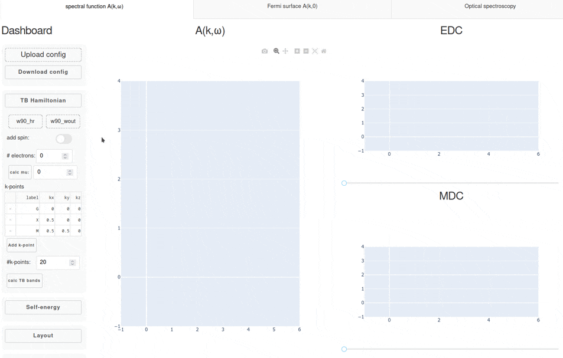
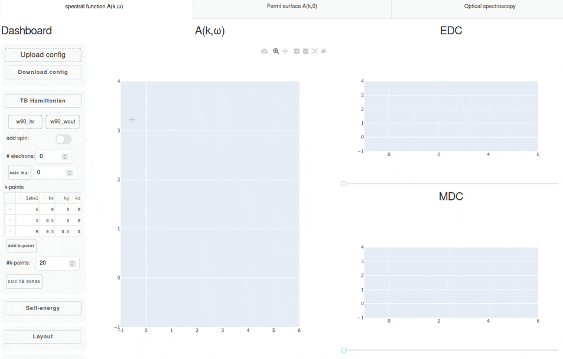
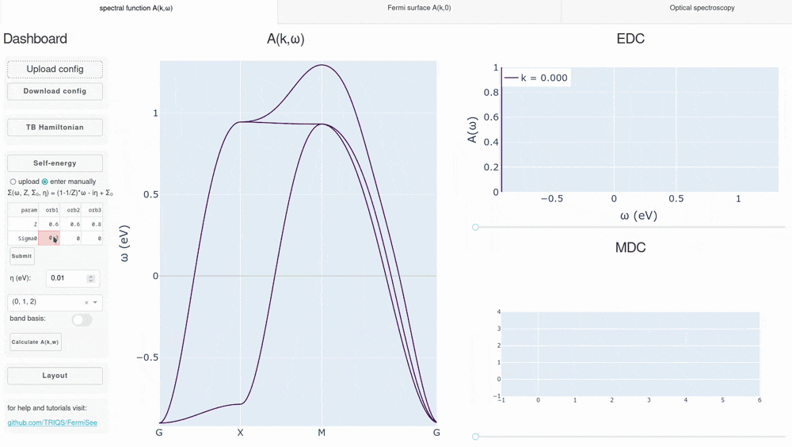

 # FermiSee


 This is a graphical spectral function A(k,w) analyzer tool, based on [triqs tight binding Hamiltonians](https://triqs.github.io/triqs/unstable/documentation/manual/triqs/lattice_tools/contents.html) decorated with a self-energy. Either provided from file in a specific h5 format (see [doc examples](doc/howto_prepare_self_energy.py)) or entered phenomenologically directly in the interface. 
 
 This tool is build with the [triqs software library](https://triqs.github.io/) and the [plotly dash library](dash.plotly.com) to export plotly figures interactively to html.

FermiSee can be either used directly as WebApp [fermisee.flatironinstitute.org](http://fermisee.flatironinstitute.org/) or can be run locally executed in the root dir of this repo:
 ```
 python app.py
 ```
 This requires the installation of [triqs](https://triqs.github.io/) and the following python packages: 
 ``` 
 pip install numpy dash dash_daq dash_bootstrap_components dash_extensions
 ```
 If you want it simple, build the WebApp via docker-compose:
 ```
 docker-compose up
 ```
open a browser and go to `127.0.0.1:9375`. To rebuild after changes in the Dockerfile:
 ```
 docker-compose build
```
or use a public docker image, available on [hub.docker.com/repository/docker/materialstheory/fermisee](hub.docker.com/repository/docker/materialstheory/fermisee)

## Features:

* plot tight binding bandstructure loaded from `wannier90_hr.dat` and `wannier90.wout` on arbitrary k-path
* automatically determine chemical potential with given filling
* change k-path and accuracy on the fly
* plot Fermi surface cuts
* download and upload config in a single h5 container
* add self-energy correction to tight binding Hamiltonian from file or add analytic form of self-energy via the interface
* add constant scattering rate η as imaginary shift

## quick video showcases

Here we showcase typical workflows in FermiSee.

### plot tight binding band structure

First, let's plot the tight binding bands from a SrVO3 Wannier Hamiltonian representing the three t2g states. Here, we show how to tune the chemical potential of the system, change the k-path, and how to save the results in a downloadable hdf5 archive.




### plot spectral function (numerical self-energy)

Next, we can load the the previous hdf5 archive, and add a numerical self-energy by uploading a hdf5 archive containing a real frequency self-energy on a regular grid. The new chemical potential is determined and the result is plotted together with the tight binding bands. We can also save the resulting plot as a png. In the end we switch to showing the quasiparticle dispersion instead of the spectral function.




### plot Fermi surface cut (analytic self-energy)

Lastly, we manually construct a self-energy using an analytic form for a Fermi liquid. We can add a quasiparticle renormalization Z, an orbital-dependent level shift, and a constant scattering rate η. Finally, we calculate the Fermi surface cut at kz=0.0 in the upper right quadrant.




©2021-2022 The Simons Foundation, Inc. - All Rights Reserved
